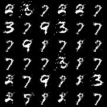
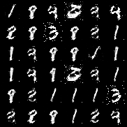

# Adversarial Generative Networks (GANs) demo

## Introduction

This repository contains a demo of **Generative Adversarial Networks** (GANs) implemented in PyTorch. The demo includes a simple GAN architecture for generating images.

## Requirements

- numpy==2.1.1
- torch==2.3.1+cu121
- torchvision==0.19.0
- torchvision==0.18.1+cu121

You can install the required packages using the following command:

```bash
pip install -r requirements.txt
```

## Project Structure

The project is organized as follows:

```
./
├── gans.py: Contains the Generator and Discriminator architecture.
├── dataset.py: Gets dataloader of the MNIST dataset.
├── train.py: Contains the training loop for the GAN.
├── test.py: Generate some images through pretrained Generator.
├── requirements.txt
└── README.md
```

## Dataset

The demo uses the [MNIST](http://yann.lecun.com/exdb/mnist/) dataset, which is a collection of handwritten digits. The dataset is preprocessed and loaded using the `dataset.py` module. You can easily download the dataset by running `train.py`, and data will be automatically saved into `./data`.

The dataset should be organized as follows:

```
data/MNIST/raw/
├── train-images-idx3-ubyte.gz
├── train-labels-idx1-ubyte.gz
├── t10k-images-idx3-ubyte.gz
└── t10k-labels-idx1-ubyte.gz
```

## Model Architecture

### Generator

```
Generator(
  (model): Sequential(
    (0): Linear(in_features=100, out_features=128, bias=True)
    (1): LeakyReLU(negative_slope=0.2, inplace=True)
    (2): Linear(in_features=128, out_features=256, bias=True)
    (3): BatchNorm1d(256, eps=0.8, momentum=0.1, affine=True, track_running_stats=True)
    (4): LeakyReLU(negative_slope=0.2, inplace=True)
    (5): Linear(in_features=256, out_features=512, bias=True)
    (6): BatchNorm1d(512, eps=0.8, momentum=0.1, affine=True, track_running_stats=True)
    (7): LeakyReLU(negative_slope=0.2, inplace=True)
    (8): Linear(in_features=512, out_features=1024, bias=True)
    (9): BatchNorm1d(1024, eps=0.8, momentum=0.1, affine=True, track_running_stats=True)
    (10): LeakyReLU(negative_slope=0.2, inplace=True)
    (11): Linear(in_features=1024, out_features=784, bias=True)
    (12): Tanh()
  )
)
```

### Discriminator

```
Discriminator(
  (model): Sequential(
    (0): Linear(in_features=784, out_features=512, bias=True)
    (1): LeakyReLU(negative_slope=0.2, inplace=True)
    (2): Linear(in_features=512, out_features=256, bias=True)
    (3): LeakyReLU(negative_slope=0.2, inplace=True)
    (4): Linear(in_features=256, out_features=1, bias=True)
    (5): Sigmoid()
  )
)
```


## Usage

Run the following command to train the GANs:

```bash
python train.py --batch_size 128 --n_epochs 100 --lr 0.0002 --b1 0.5 --b2 0.999 --latent_dim 100 --img_size 28 --sample_interval 500 --ckpts_interval 20 --nrow 6 --warm_start false
```

All these arguments are **optional**, and you can change them according to your needs. The default values are set to values that have been found to work well in practice.

The generator and discriminator models are saved into `./ckpts` every 20 epochs, and the generated images are saved into `./images` every 500 batches.

To test the trained generator model, run the following command:

```bash
python test.py --ckpt_id ckpt_id --epoch_id epoch_id --save_dir path/to/save/directory
```

The former two arguments `ckpt_id` and `epoch_id` are **required** to find and load pretrained generator model. The samples are saved into directory determined by `save_dir` with a dafault value `./samples`. Here are two examples:


